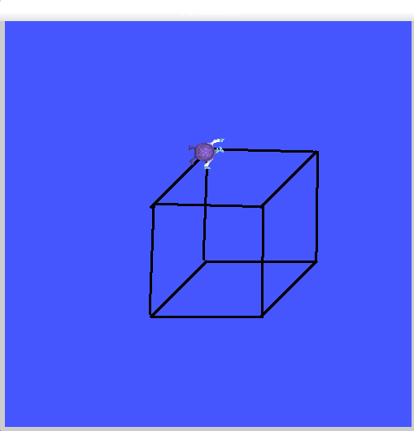

# `tat_e0u_benya` package
ROS 2 C++ package.  [](https://docs.ros.org/en/humble/)

A package egy draw node-ból áll. A turtleslim simulator segítségével képes egy 3d kocka 2d-s vetületét kirajozlni. A a mozgást "/turtle1/cmd_vel", a toll vezérlését "/turtle1/set_pen", teleportálását "/turtle1/teleport_absolute"- szolgáltatás segítségével valósítja meg ROS 2 Humble alatt. 


## Packages and build

It is assumed that the workspace is `~/ros2_ws/`.

### Clone the packages
``` r
cd ~/ros2_ws/src
```
``` r
git clone https://github.com/Wexemm/tat_e0u_benya
```

### Build ROS 2 packages
``` r
cd ~/ros2_ws
```
``` r
colcon build --packages-select tat_e0u_benya --symlink-install
```

<details>
<summary> Don't forget to source before ROS commands.</summary>

``` bash
source ~/ros2_ws/install/setup.bash
```
</details>

``` r
ros2 launch tat_e0u_benya launch_example1.launch.py
```

# Képernyőkép a kirajzolt objektumról


<p align="center"></p>


Let's assume 
- your Github username is `Wexemm`
- your ROS 2 repo shold be `tat_e0u_benya`

Replace everything in the cloned repo:

- `tat_e0u_benya` >> `cool_ros2_package` (the folder was already renamed after `Use this template`)
- `Wexemm` >> `mycoolusername`
- find all `todo` strings and fill the blanks

The easiest way is VS code:

<p align="center"></p>

Now `colcon build` your ROS 2 package and you can start wokring.
